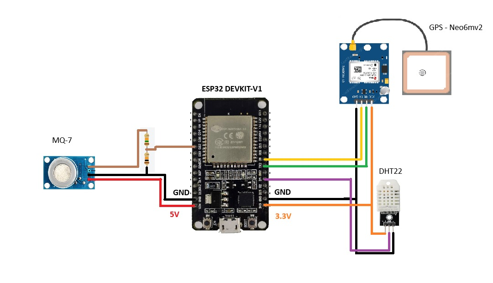
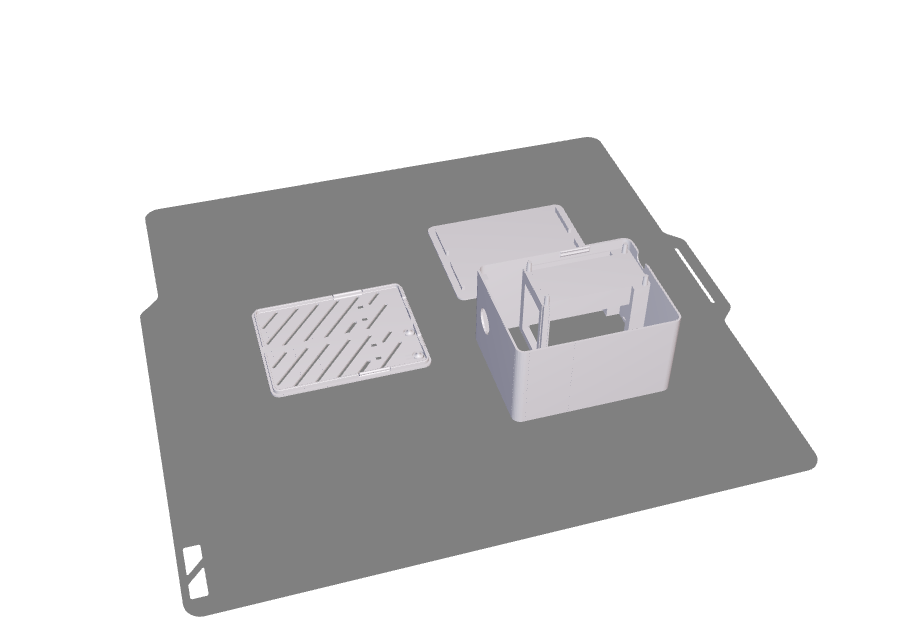

# 🌍 Community Hardware & Environmental Monitoring Project

Welcome to the **Community Hardware & Environmental Monitoring Project** — an open initiative for students and developers to **create hardware solutions** aimed at **learning and contributing** to real-world environmental monitoring systems.

---

## 🎓 About the Project

This repository brings together the **student community** to collaboratively design and build **educational hardware** focused on:
- Embedded systems  
- IoT (Internet of Things)  
- Data collection and transmission  
- Environmental monitoring  

The goal is not only to **learn and share knowledge**, but also to **generate useful environmental data** for research and mobile/web applications related to **air quality prediction**.

---

## 🧩 Example Data Collected

- `internalHumidity`  
- `temperature`  
- `latitude`  
- `longitude`  
- `CO`  
- `O3`  
- `NO2`  
- `PM25`  

These data points can be collected using different sensors connected to microcontrollers like **ESP32**, **Arduino**, or **Raspberry Pi**, and sent to web platforms or APIs for analysis.

---

## 🤝 How to Contribute

We welcome contributions from students, educators, and tech enthusiasts!  
Here are some ways you can get involved:

- 🧠 Create **new hardware projects** (ESP32, Arduino, Raspberry Pi, etc.)  
- 💾 Add **sensor integrations** (CO, O₃, NO₂, PM2.5, temperature, humidity, etc.)  
- 🧰 Improve **firmware, documentation, or examples**  
- 📊 Share **data samples** for training and testing air quality prediction models  
- ✍️ Write **tutorials** or guides to help others learn  

---

## 🗂️ Repository Structure (suggested)

  

  

